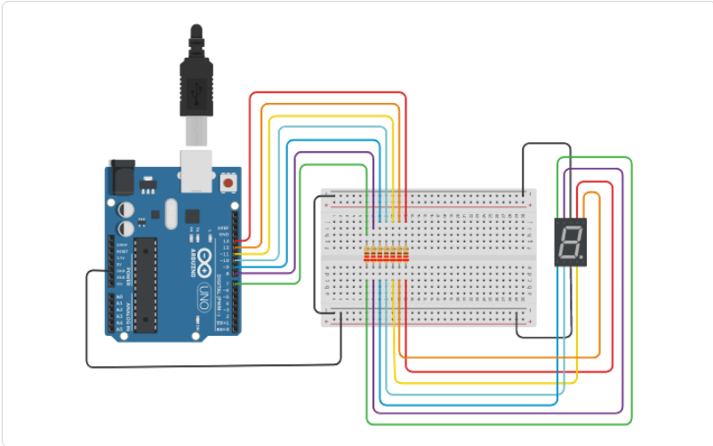

# PT-BR
<h2 align="center">Contador 7 Segmentos</h2>

## 📝 Conteúdos

- [Sobre](#sobre)
- [Começando](#comecando)
- [Sistema](#usage)
- [Esquematico](#esquematico)
- [Autor](#autor)

## 🧐 Sobre <a name = "sobre"></a>

Projeto de aprendizado sobre contador 7 segmentos. Neste projeto foi feito uma contagem do 0 até o 9 em u contador 7 segmentos, onde quando chega ao numero 9 ele recomeça a contagem indeterminadamente.

Foi utilizado o VSCode com a extensão PlatformIO para o projeto, e na parte eletrônica foi feito no ambiente virtual do [TikerCad](https://www.tinkercad.com/) que é totalmente gratuíto.

Foram utlizados os seguintes commponentes: 

Componentes | Quantidade
------------|----------
Arduino Uno R3 | 1
Contador 7 Segmentos (catôdo comun) | 1
Resistor 220 Ω | 7

Os componentes assima podem ser alterados por outros, mas caso faça verifique a compatibilidade deles com o porjeto, dependendo da alteração deverá fazer alteração no código ou no esquemático de ligação dos componentes.


## 🏁 Começando <a name = "comecando"></a>

### Pré-requisitos

Caso for utilizar arduino físico e não o do sistema cirtual, priimeiro precisará ter instalado em seu computador algum compilador para o Arduino (ou semelhante).

```
ArduinoIDE
VSCode + PlatformIO
```
Obs.: O PlatformIO possui extensão para outros editores de textos como Sublime, Vim, Eclipse...

Todas estas informações ou mais estão disponíveis na documentação oficial do [PlatformIO/docs](https://docs.platformio.org/en/latest/)

Caso for utilizar o próprio sistema virtual para o projeto, só precisa copiar o código q esta no **main.cpp** dentro da pasta **src** com o editor de texto padrão do sistema e colar na parte de código do TrinkerCAD. Obs.: retirar a 1º linha #include<Arduino.h> se não apresentará erro.

### Baixando o proejto

Pode ser baixado via arquivo .zip ou cloando o repositório.
Caso seguir para a parte do repositório tera que ter instalado o GIT no seu computador

Comando para clonar o repositório.

```
git clone https://github.com/Joao-gui/Counter_7seg.git
```

## 🎈 Sistema <a name="usage"></a>

* Linux Mint 21.2 x86_64
* VSCode
* PlatformIO (extensão VSCode)
* TinkerCAD

## ⛏️ Esquemático <a name = "esquematico"></a>



## ✍️ Autor <a name = "autor"></a>

- [@Joao-gui](https://github.com/Joao-gui)